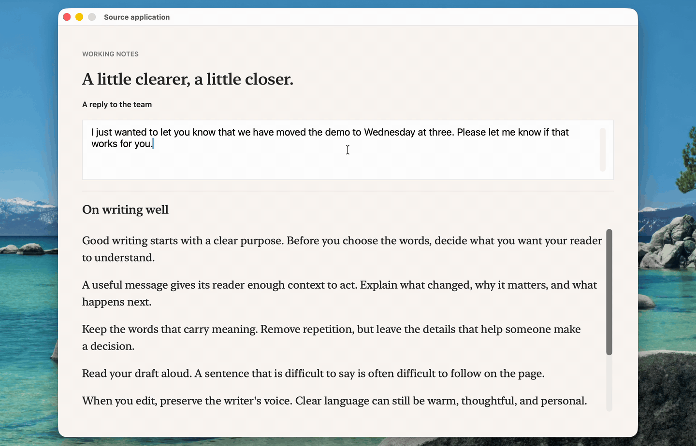
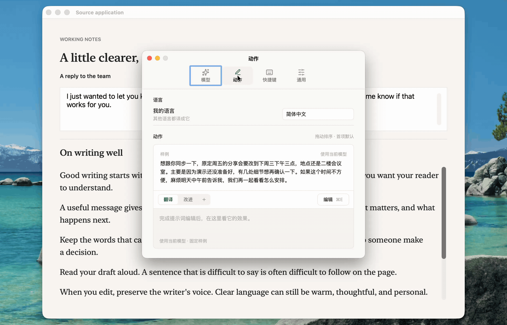
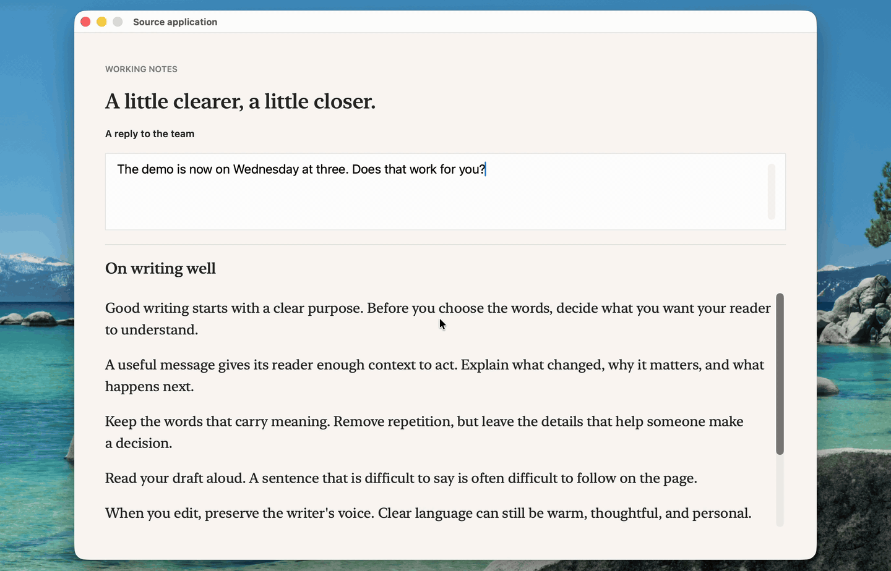

<p align="center">
  
</p>

<h1 align="center">Cida · 辞达</h1>

<p align="center">
  Translate and polish text anywhere on your Mac, with the language model you choose.<br>
  <a href="https://cida.xuanwo.io/en/">Website</a> · <a href="https://cida-releases.xuanwo.io/latest/Cida.dmg">Download</a> · <a href="README.md">简体中文</a>
</p>

## How it works

- **Select text and press <kbd>⌥</kbd> <kbd>A</kbd>.** The panel appears with your selection and runs the first action, translation by default. When translating, text in other languages comes into your language, Simplified Chinese unless Settings says otherwise, in any language, dialect or register such as Cantonese; text in your language goes into the foreign language written after 翻译成, English by default, and you rewrite it right there, such as 日本語 or British English.

  

- **Select text and press <kbd>⌥</kbd> <kbd>F</kbd> to improve and replace it.** The text stays in its original language; <kbd>⌘</kbd> <kbd>Z</kbd> in the source app undoes the replacement. Press the shortcut again during generation to cancel. If you edit, change the selection or switch apps, Cida keeps the result for you to view and copy.

  

- **Add your own text actions in Settings → 动作.** Write a name and prompt for shortening text, extracting tasks or drafting an email, then click Done to preview the fixed sample with your current model. Drag to reorder; the first action becomes the panel default. Screenshot and in-place translation still translate.

  

- **For text on the screen, press <kbd>⌥</kbd> <kbd>S</kbd>.** Frame what you want translated; Cida recognizes it on your Mac and translates it.

  

- **To read in place, point at a paragraph and press <kbd>⌥</kbd> <kbd>D</kbd>.** It turns into its translation where it stands, among the original messages around it; press again to turn it back.

  

- **To keep reading a language you do not read, press <kbd>⌥</kbd> <kbd>⇧</kbd> <kbd>D</kbd> to translate the whole window.** In a Slack channel or a long article, new text is translated as it appears, and a second press stops; to see one paragraph in the original, point at it and press <kbd>⌥</kbd> <kbd>D</kbd>. Translations are set on Cida's paper and code stays as it is; clicks and scrolling still reach the app.

  

<kbd>Esc</kbd> takes you back to your app. A request keeps running while the panel is hidden, and the result is there when you bring it back.

The interface is in Simplified Chinese.

## Install

You need macOS 15 or newer and a language model service.

1. Download [Cida.dmg](https://cida-releases.xuanwo.io/latest/Cida.dmg). It is signed with a Developer ID and notarized by Apple.
2. Open the DMG, drag 辞达 into Applications (应用程序), then open it from Launchpad or Spotlight. Cida lives in the menu bar, not the Dock.
3. Press <kbd>⌘</kbd> <kbd>,</kbd>, click 复制配置提示词 to copy the configuration prompt, and give it to an AI assistant such as Claude Code or Codex. It asks which service you want, configures Cida through its [command line](#command-line) and runs `check` to confirm the model answers.

Your API key never passes through the assistant: it asks you to copy the key and run one command that stores it in the Keychain. Cida speaks OpenAI Chat Completions, Responses and Anthropic Messages; a model running on your Mac (such as `http://127.0.0.1:8080`) needs no key. Cida is free; your provider charges for the requests.

Two permissions are optional. Turn them on with 去授权 on the 快捷键 tab of Settings:

| Permission | With it | Without it |
| --- | --- | --- |
| Accessibility | <kbd>⌥</kbd> <kbd>A</kbd> imports selections; <kbd>⌥</kbd> <kbd>D</kbd> translates in place; <kbd>⌥</kbd> <kbd>F</kbd> improves and replaces | Copy with <kbd>⌘</kbd> <kbd>C</kbd>, then paste into the panel; no in-place translation or selection replacement |
| Screen Recording | <kbd>⌥</kbd> <kbd>S</kbd> translates text on screen; in-place translations can follow vertical scrolling | No screenshot translation; in-place translations return after scrolling stops |

## Privacy

- The API key is stored only in the macOS Keychain.
- There is no history and no telemetry; text processing and action preview requests go only to the provider you chose.
- Screenshots are recognized on your Mac with Apple's Vision and never leave it. In-place translation reads text through Accessibility. With Screen Recording already allowed, it also processes images of the source window in memory on your Mac to follow scrolling; these images are neither saved nor uploaded. Without that permission, translations hide during scrolling and return once it stops.

## Keys

| Key | Action |
| --- | --- |
| <kbd>⌥</kbd> <kbd>A</kbd> | Show or hide the panel |
| <kbd>⌥</kbd> <kbd>S</kbd> | Translate text on screen |
| <kbd>⌥</kbd> <kbd>D</kbd> | Translate in place: the paragraph under the pointer, again to turn it back; with <kbd>⇧</kbd>, the whole window |
| <kbd>⌥</kbd> <kbd>F</kbd> | Improve and replace the selection; press again during generation to cancel |
| <kbd>Tab</kbd> | Cycle through actions in their saved order |
| <kbd>Return</kbd> | Run (<kbd>⇧</kbd> <kbd>Return</kbd> for a new line) |
| <kbd>Esc</kbd> | Hide the panel |

All four global shortcuts can be changed or cleared in Settings.

## Command line

The executable inside the app is Cida's command line; there is nothing else to install. It shares its configuration with the running Cida, which picks up every change at once:

```sh
cida=/Applications/Cida.app/Contents/MacOS/Cida
$cida config schema                        # every field, its values and what it does
$cida config show
$cida config set model=deepseek-chat       # several fields at once; unset and reset too
pbpaste | $cida config set api-key --stdin
$cida check --verbose                      # one real request; on failure, the request and response
```

Every command takes `--json`. The API key is read only from `--stdin`, `--file` or `--env`; a key written as an argument is refused. [`Design/spec/configuration.md`](Design/spec/configuration.md) describes every field.

## Updates

Cida checks `https://cida-releases.xuanwo.io/appcast.xml` once a day. When a new version is out, its panel shows the update notes and installs the update once you agree. The daily check sends no system information; you decide whether to install an update.

## Uninstall

Quit Cida and move it from Applications to the Trash. To remove every trace, also delete the Keychain Access item named `com.xuanwo.Cida` and `~/Library/Preferences/com.xuanwo.Cida.plist`.

## Contributing

```sh
git clone https://github.com/Xuanwo/cida.git
cd cida
swift run Cida
```

Building needs Xcode 26 or newer. [`docs/development.md`](docs/development.md) covers building, testing and releasing, [`Design/`](Design/README.md) holds the design, and [`AGENTS.md`](AGENTS.md) lists the rules for changes.

## License

[Apache-2.0](LICENSE).

The name comes from the *Analects*: 辞达而已矣, words need only get the meaning across.
